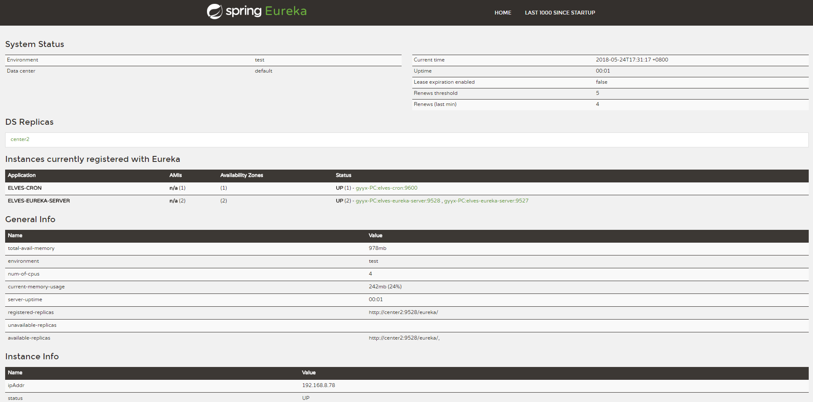
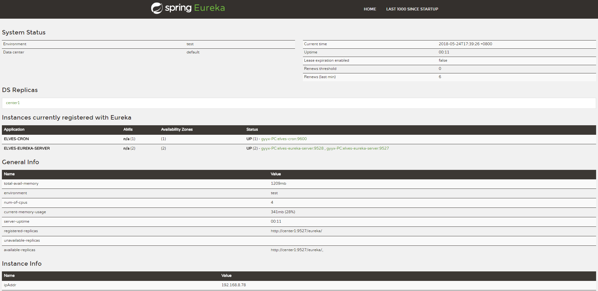

# elves-spring-cloud
用spring cloud 实现一版elves

# 架构图

# 1. elves-eureka 注册中心

	host修改：

			127.0.0.1 center1
			127.0.0.1 center2

	启动脚本：

	java -jar --spring.profiles.active=center1
	java -jar --spring.profiles.active=center2

## 地址： http://127.0.0.1:9527/

## 地址： http://127.0.0.1:9528/

# 2. elves-openapi

# 3. elves-cron

# 4. elves-queue

# 5. elves-supervisor

